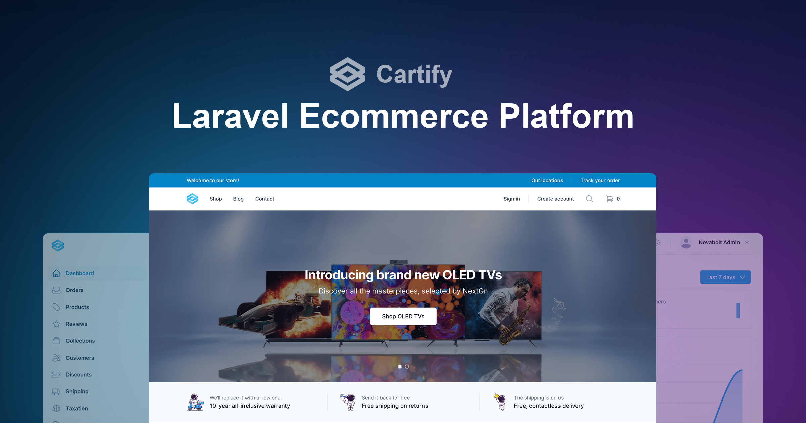

Welcome to Cartify, the cutting-edge ecommerce platform that revolutionizes the way you do online business. Built with
the powerful combination of **Laravel**, **Livewire**, **Alpine.js**, and **Tailwind CSS**, Cartify brings you a
comprehensive suite of features and an unparalleled user experience.

In today's fast-paced digital landscape, establishing a successful online store requires more than just a website. It
demands a seamless integration of technology, design, and user-centric functionalities. That's where Cartify steps in,
empowering entrepreneurs and businesses of all sizes to thrive in the competitive world of ecommerce.

With Cartify, we have meticulously crafted an ecommerce platform that encapsulates the latest advancements in web
development. Leveraging the robustness of Laravel, a renowned PHP framework, Cartify ensures scalability, security, and
flexibility, providing a solid foundation for your online business.

Livewire, a powerful Laravel package, takes your store's interactivity to the next level. It allows for dynamic and
real-time updates, enhancing user engagement and creating a more immersive shopping experience. Seamlessly integrated
with Laravel, Livewire enables you to effortlessly manage and control the data flow within your ecommerce platform.

Cartify's stunning visual appeal owes credit to Tailwind CSS, a utility-first CSS framework. With its extensive set of
pre-designed components and intuitive styling, Tailwindcss makes it a breeze to customize the look and feel of your
online store, ensuring a unique and visually captivating experience for your customers.

But Cartify is more than just the sum of its parts. We understand that running a successful ecommerce business entails
managing various aspects seamlessly. That's why we have equipped Cartify with an extensive array of features, catering
to every essential aspect of your online store. From robust product management to secure payment gateways, from
intuitive inventory management to customizable storefronts, Cartify has got you covered.

With Cartify, you can effortlessly showcase your products, manage orders, track inventory, and analyze sales
performance, all within a unified and user-friendly interface. Our platform is designed to empower you with the tools
and insights you need to make informed decisions and drive your business towards success.

Whether you're a budding entrepreneur looking to launch your first online store or an established business seeking to
elevate your ecommerce game, Cartify is here to be your trusted companion on your journey to digital prosperity.

Experience the power of Cartify today and unlock a world of endless possibilities for your ecommerce business. Get
started and embark on a new era of online success!
